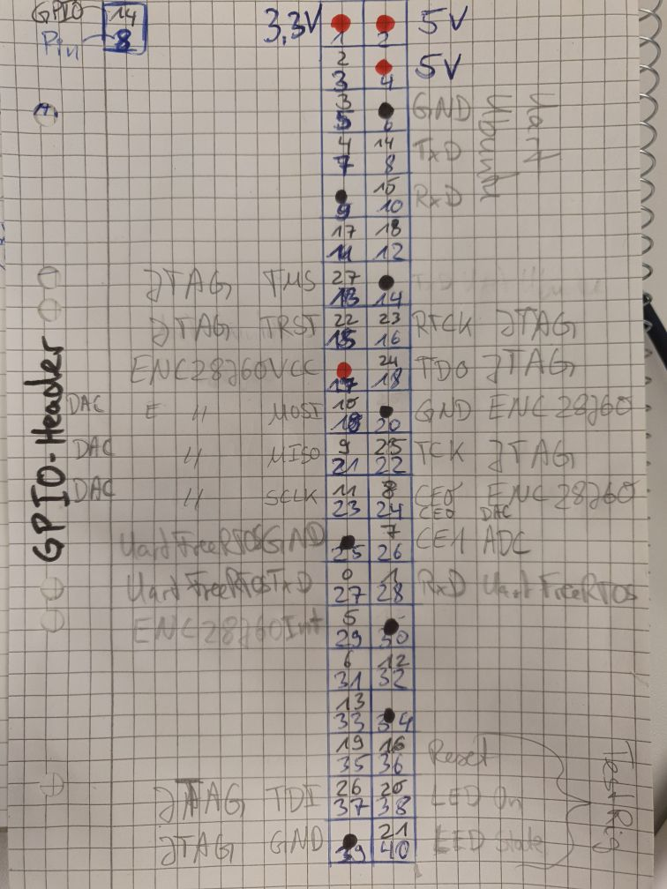

# raspi4_freertos

This repository includes a FreeRTOS UART and ENC28J60 sample application which can run on Raspberry Pi 4B.

## 1. Overview

This FreeRTOS porting uses UART2(PL011). The sample application is designed to be launched by u-boot and to operate together with 64-bit Linux.

This implementation is based on another FreeRTOS porting for Raspberry Pi 3 by eggman [1] (many thanks to him!).  

The sample application runs on the CPU core #3 on your Raspberry Pi 4B board. A specified memory region (0x20000000 - 0x207FFFFF) is dedicated to this application. Modify `FreeRTOS/Demo/CORTEX_A72_64-bit_Raspberrypi4/uart/src/raspberrypi4.ld` if you want to change the memory usage.

ARMv8-A MMU is available with VA = PA configuration. The current implementation employs 2-level address translation (1GB-page for the 1st level, 2MB-page for the 2nd level). See `FreeRTOS/Demo/CORTEX_A72_64-bit_Raspberrypi4/uart/src/mmu.c` for the detail.

[1] https://github.com/eggman/FreeRTOS-raspi3

## 2. Prerequisites

As prerequisite we need a working linux installation on the RPi4. So if you have a blank sd-card, install linux and follow this tutorial.
Or if you already have a formatted sd-card, copy the folder .\SD-Card onto your SD-Card and continue at UART configuration.

### Linux installation

Install 64-bit RaspOS on your Raspberry Pi 4B from SVN (D71ADevRaspi\RaspOS_Image) with RPi Imager:
start Imager

select OS -> use custom -> path to D71ADevRaspi\RaspOS_Image -> select "2024-11-19-raspios-bookworm-arm64-lite.img"

select SD-Card -> (sd-card which you plugged in)

Alternatively you can use one of the downloadlinks:
https://ubuntu.com/download/raspberry-pi
https://wiki.debian.org/RaspberryPi4

### GPIO-Configuration
To use external chips (Ethernet, Uart-Interface, ...) you have to connect the following pins:




### UART configuration


This figure illustrates an expected UART configuration. You need to prepare for two different serial consoles for each UART port dedicated to u-boot/Linux or FreeRTOS.

UART1(mini UART) for u-boot must be configured to use the GPIO ALT5 setting. Add `enable_uart=1` to `config.txt`. See https://www.raspberrypi.org/documentation/configuration/uart.md for the detail.

UART2(PL011) for FreeRTOS is  automatically configured to use the GPIO ALT4 setting in the FreeRTOS UART application. So you do not need to configure the UART port manually.

### Compiler installation

You need to install a GCC toolset for aarch64, and can get it from [2]. I used AArch64 ELF bare-metal target (aarch64-none-elf) version 9.2.1 for this repository.

[2] https://developer.arm.com/tools-and-software/open-source-software/developer-tools/gnu-toolchain/gnu-a/downloads

##### Linux
Don't forget to add its binary path to $PATH. This should be done on your Raspi4 Linux environment.

##### Windows

You dont need to add its binary to %PATH%, it will be done in makeDemo.bat. For that put the folder of the compiler to the following path: `C:\camel-dev\D71\` so your compiler is at `C:\camel-dev\D71\gcc-arm-10.3-2021.07-mingw-w64-i686-aarch64-none-elf\bin`

You also need to install msys64 [3] directly under `C:\` so its available at: `C:\msys64\usr\bin`

[3] https://github.com/msys2/msys2-installer/releases/download/2024-12-08/msys2-x86_64-20241208.exe

### u-boot compilation

A pre-built u-boot image provided by Ubuntu or Debian may not have the `dcache` command on the u-boot prompt. You need compile and install u-boot having cache management commands if u-boot provided by your Linux distribution does not have them.

(1) Source code download  
`$ git clone https://github.com/u-boot/u-boot`  

(2) Compilation
```
$ cd u-boot
$ export CROSS_COMPILE=aarch64-none-elf-
$ echo 'CONFIG_CMD_CACHE=y' >> ./configs/rpi_4_defconfig
$ make rpi_4_defconfig
$ make -j4 (if your PC has 4 processor cores)
```
(`CROSS_COMPILE` must be changed depending on a compiler you installed)

(3) Copy the binary to your SD card  
```
$ sudo cp ./u-boot.bin /path/to/sd_boot_partition/kernel8.img
```
(The new file name must be `kernel8.img`)

## 3. FreeRTOS UART sample build

#### Linux
Very simple! Just execute the following commands.
```
$ cd Demo/CORTEX_A72_64-bit_Raspberrypi4/uart
$ make CROSS=aarch64-none-elf-
```
(`CROSS` must be changed depending on a compiler you installed)

#### Windows
Also very simple, just run the following batchfile:
```
cd Demo\CORTEX_A72_64-bit_Raspberrypi4
.\makeDemo.bat
```
### MMU

MMU is enabled by default. You can easily disable it by removing or commenting out the configure_mmu() call.
```
(in FreeRTOS/Demo/CORTEX_A72_64-bit_Raspberrypi4/uart/src/startup.S)
...
start_el1:
    ...
    // configure MMU
    // ldr   x0, =configure_mmu
    // blr   x0
    ...
```

Modify the page table configuration before compiling, if you want to change the memory location.  
(You must modify i) the linker script file `raspberrypi4.ld` and ii) the device tree overly file `raspi4-rpmsg.dtso` too!)
```
(in FreeRTOS/Demo/CORTEX_A72_64-bit_Raspberrypi4/uart/src/mmu.c)

/* Page table configuration array */
#define NUM_PT_CONFIGS (5)
static struct ptc_t pt_config[NUM_PT_CONFIGS] =
{
    { /* Code region (Read only) */
        .addr = 0x20000000ULL,
        .size = SIZE_2M,
        .executable = XN_OFF,
        .sharable = NON_SHARABLE,
        .permission = READ_WRITE,
        .policy = TYPE_MEM_CACHE_WB,
    },
    ...
}
```

### ENC28J60 settings
The sample includes a ENC28J60-sample sending an arp-request to network.
The network-settings of this Demo are:

```
main.c
MAC-Address     C0:FF:EE:C0:FF:EE   (in configMAC_ADDR0, configMAC_ADDR1, ...)
IP-Address      192.168.178.20      (in configIP_ADDR0, configIP_ADDR1, ...)
Gateway         192.168.178.1       (in configGATEWAY_ADDR0, configGATEWAY_ADDR1, ...)
DNS-Server      192.168.178.1       (in configDNS_SERVER_ADDR0, configDNS_SERVER_ADDR1, ...)
Netmask         255.255.255.0       (in configNET_MASK0, configNET_MASK1, ...)

NetworkInterface.c
uint8_t myMAC[6] = { 0xc0, 0xff, 0xee, 0xc0, 0xff, 0xee };
uint8_t routerMAC[6] = { 0xff, 0xff, 0xff, 0xff, 0xff, 0xff };
uint8_t deviceIP[4] = { 192, 168, 178, 20 };
uint8_t routerIP[4] = { 192, 168, 178, 1 };                     // which MAC-Address will be ask for
```

change accordingly


## 4. Launching FreeRTOS by u-boot

#### Linux
(1) Copy the obtained binary to your SD card
```
$ sudo ./uart.elf /path/to/sd_boot_partition/
```
#### Windows
(1) Copy the obtained binary to your SD card
```
.\copy_uart_elf_to_sd_card.bat
```

(2) Get the u-boot command on your Raspberry Pi 4B board  
Insert your SD card into your board, then power it on.

(3) Launch the FreeRTOS sample program on the u-boot prompt
```
fatload mmc 0:1 0x28000000 /path/to/uart.elf
bootelf 0x28000000
```

You will see output by the UART sample program.
```
****************************

    FreeRTOS UART Sample

  (This sample uses UART2)

****************************
Initializing SPI...
xNetworkBuffersInitialise() passsed

0000000000000000
Task Name       State   Prio-   Stack   Task
                        rity    Left    Number
-------------------------------------------------------------
Task A          X       7       392     2
IP-task         R       2       962     3
IDLE            R       0       162     4
initTask        R       0       562     1
Tmr Svc         B       7       350     5

prvIPTask started
bNetworkInterfaceInitialise startedStarting network up.
Setting MAC address to C0:FF:EE:C0:FF:EE.
Network card successfully initialised.
Waiting for ifup...
network is up and running.
target-IP is 192.168.178.1
Sending ARP request.
Waiting for ARP response.
waiting!
waiting!
waiting!
...
...
```


<!--
## 5. Launching FreeRTOS and Linux

This is little bit complicated. Follow the procedure below.

### Device tree overlay for FreeRTOS

You have to build a device tree overlay binary file for FreeRTOS. This process should be done on your Raspi4 Ubuntu(Debian) environement.

```
# Install the dtc command, a device tree compiler
$ sudo apt-get install device-tree-compiler

# Build a device tree overlay binary file and copy it under /boot/firmware/overlays
$ cd ./dts
$ dtc -O dtb -I dts ./raspi4-rpmsg.dtso -o ./raspi4-rpmsg.dtbo 
$ sudo cp ./raspi4-rpmsg.dtbo /boot/firmware/overlays/

# Add overlay configuration "dtoverlay=raspi4-rpmsg" to the [all] section in config.txt
$ cat /boot/firmware/config.txt
...
...

[all]
arm_64bit=1
...
...
dtoverlay=raspi4-rpmsg
```

### Sample program compilation  
You need to add a macro `-D__LINUX__` to `CFLAGS` in Makefile. This macro adds a special function to avoid GIC configuration change by Linux.

```
$ cd Demo/CORTEX_A72_64-bit_Raspberrypi4/uart/
$ grep ^CFLAGS Makefile
CFLAGS = -mcpu=cortex-a72 -fpic -ffreestanding -std=gnu99 -O2 -Wall -Wextra -I$(INCLUDEPATH1) -I$(INCLUDEPATH2) -I$(INCLUDEPATH3) -DGUEST -D__LINUX__
$ make CROSS=aarch64-none-elf-
```
(`CROSS` must be changed depending on a compiler you installed)

### Copy the obtained binary to your SD card  

Same as 4-(1) above.

### Linux kernel parameter change

Add `maxcpus=3` to `cmdline.txt`. This enables Linux to use only CPU cores #0-2. The CPU core #3 can be used by FreeRTOS safely.

### Launching FreeRTOS
Same as 4-(3). Execute the following commands on the u-boot prompt.
```
setenv autostart yes
dcache off
ext4load mmc 0:2 0x30000000 /path/to/uart.elf
dcache flush
bootelf 0x30000000
dcache on
```
But you will see only a message
```
Waiting until Linux starts booting up ...
```
on UART2(PL011) until you launch Linux.

### Launching Linux

Quite simple. Just execute
```
run bootcmd
```
on the u-boot prompt. You will see Linux boot process output on UART1(mini UART) and FreeRTOS UART output on UART2(PL011).
-->

## 5. Debugging

### On your Raspberry Pi 4B board

(1) Boot Linux, then add `enable_jtag_gpio=1` to `config.txt`.

(2) Reboot your Raspberry Pi 4B board.

### On your PC for remote debugging

#### Linux

(1) Compile and install the latest OpenOCD (http://openocd.org/repos/).

(2) Download a OpenOCD configuration file for Raspberry Pi 4B from [3] (Many thanks to the author!).
Then, comment out several lines from the file as shown below.

```
...
#   if {$_core != 0} {
#       set _smp_command "$_smp_command $_TARGETNAME.$_core"
#   } else {
#       set _smp_command "target smp $_TARGETNAME.$_core"
#   }
...
}

# eval $_smp_command
# targets $_TARGETNAME.0
```
[3] https://gist.github.com/tnishinaga/46a3380e1f47f5e892bbb74e55b3cf3e

(3) Start the OpenOCD process.
```
$ openocd -f /path/to/your_debugger.cfg -f raspi4.cfg
```

`your_debugger.cfg` varies depending on a debugger you use. It can be found in `tcl/interface/` included in the OpenOCD source directory.

(4) Connect to OpenOCD by gdb.
```
$ aarch64-none-elf-gdb /path/to/uart.elf

(on gdb console)
target remote localhost:3336
```
(`aarch64-none-elf-` must be changed depending on a compiler you installed)

You are now ready to start debugging FreeRTOS running on Cortex-A72 core#3. You can add the source code path on the gdb console.

#### Windows

You can use the DebugSetup.bat in the uart-folder: Install putty and save 2 configs (guessing you have 2 Uart-adapters e.g. two of this one [4]):

1. (GPIO14 and GPIO15)
```
Type:           serial
Speed:          115200
data bits:      8
stop bits:      1
parity:         none
flow control:   none

session name: RPi4_Ubuntu
```
2. (GPIO0 and GPIO1)
```
Type:           serial
Speed:          115200
data bits:      8
stop bits:      1
parity:         none
flow control:   none

session name: RPi4_FreeRTOS
```
Select the COM-ports of your setups.


[4] https://www.raspberrypi.com/products/debug-probe/

## 7. License

MIT License derived from FreeRTOS. See `LICENSE.md` for the detail.
```
./FreeRTOS/Demo/CORTEX_A72_64-bit_Raspberrypi4/uart/
./FreeRTOS/Source/
```

MIT License derived from musl libc(https://musl.libc.org/). See individual files for the detail.

```
./FreeRTOS/Demo/CORTEX_A72_64-bit_Raspberrypi4/musl_libc/
```

GPL-2.0 derived from u-boot(https://github.com/u-boot/u-boot). See individual files for the detail.
```
./FreeRTOS/Demo/CORTEX_A72_64-bit_Raspberrypi4/cache/
```

GPL-2.0 derived from Linux(https://github.com/raspberrypi/linux).
```
./dts/
```

